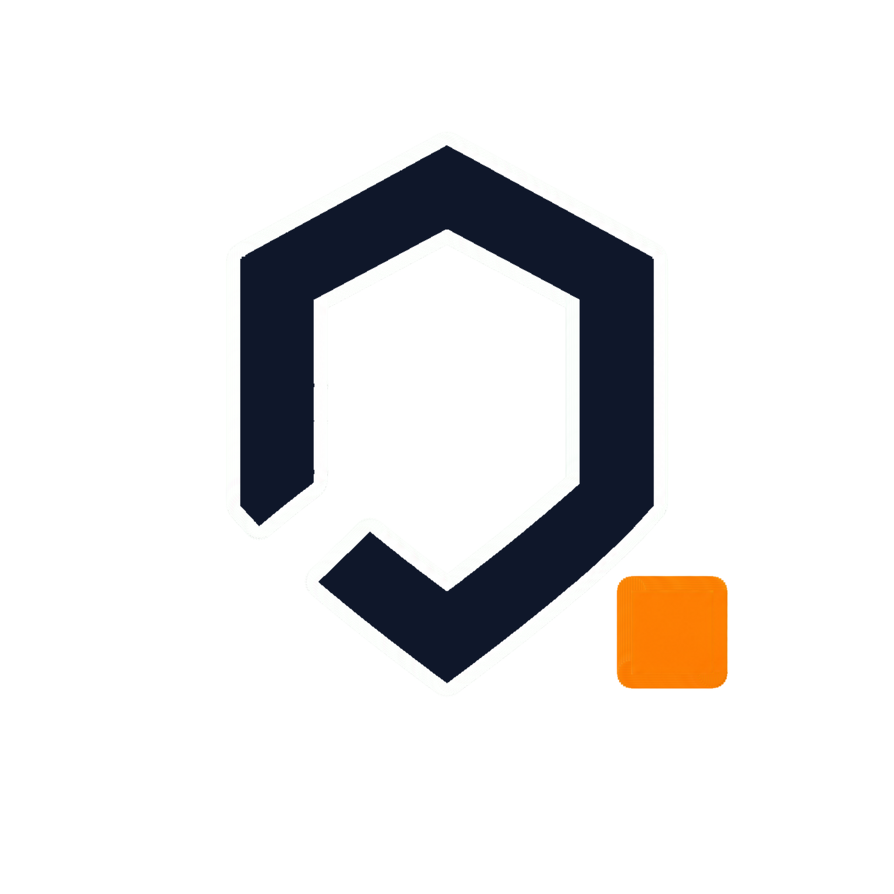
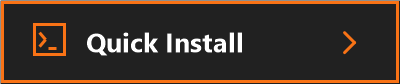
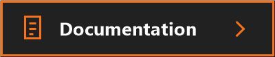
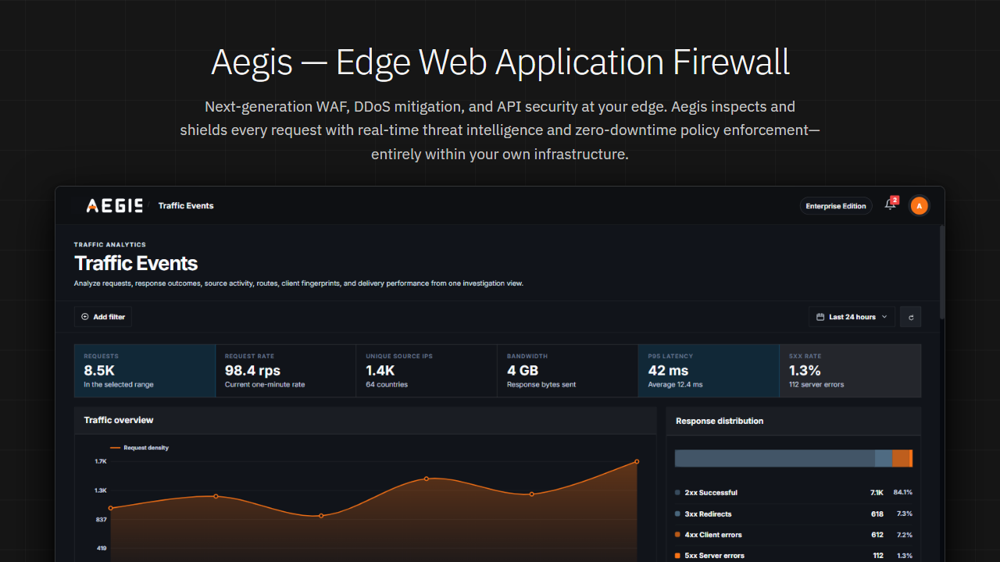
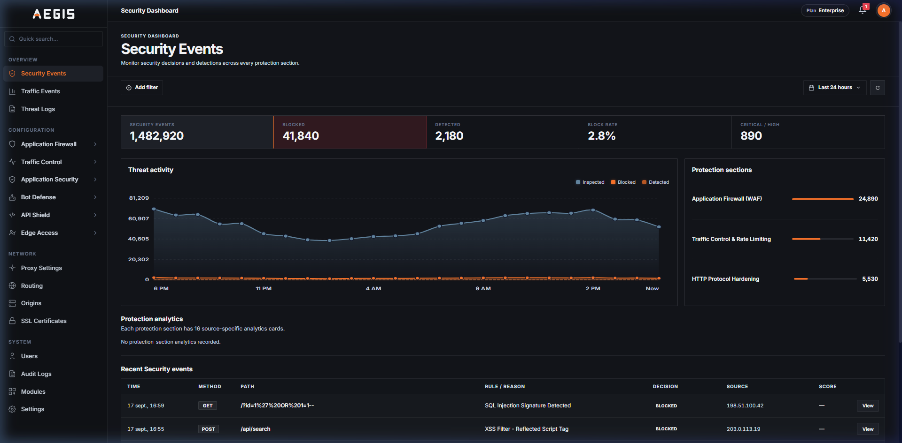
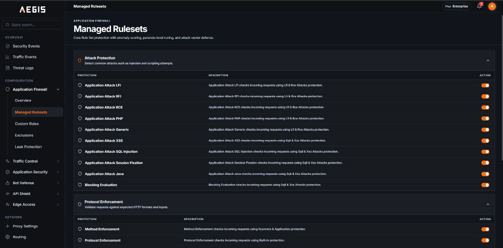
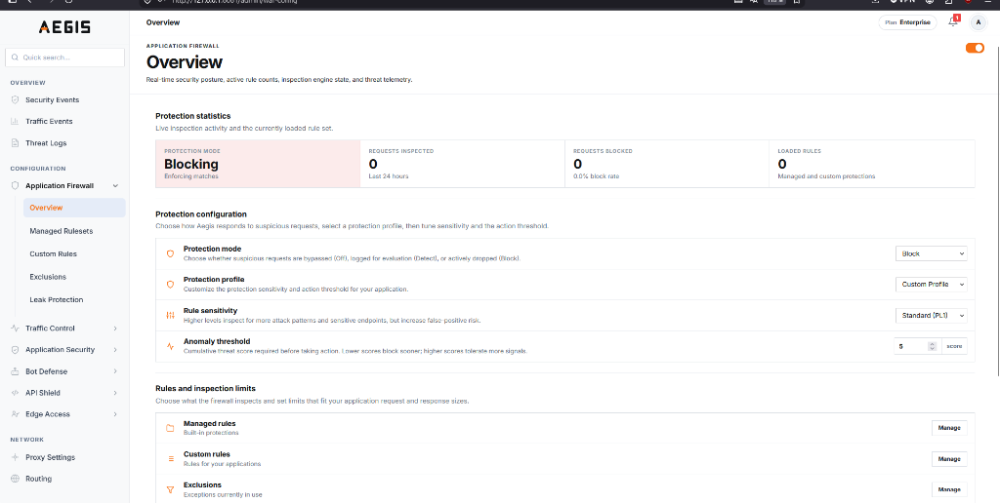
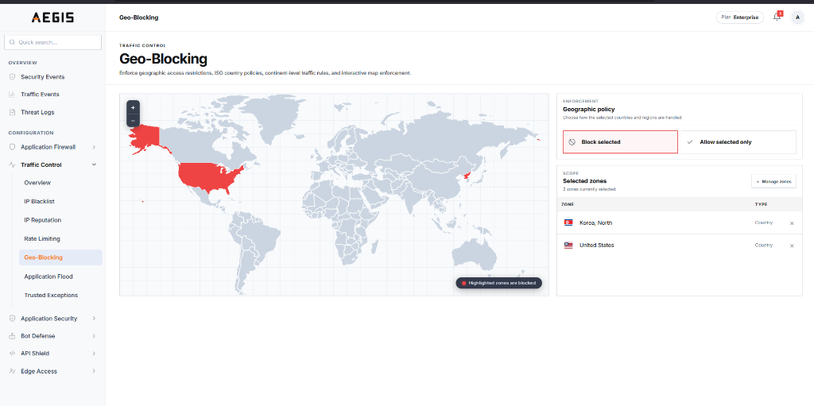
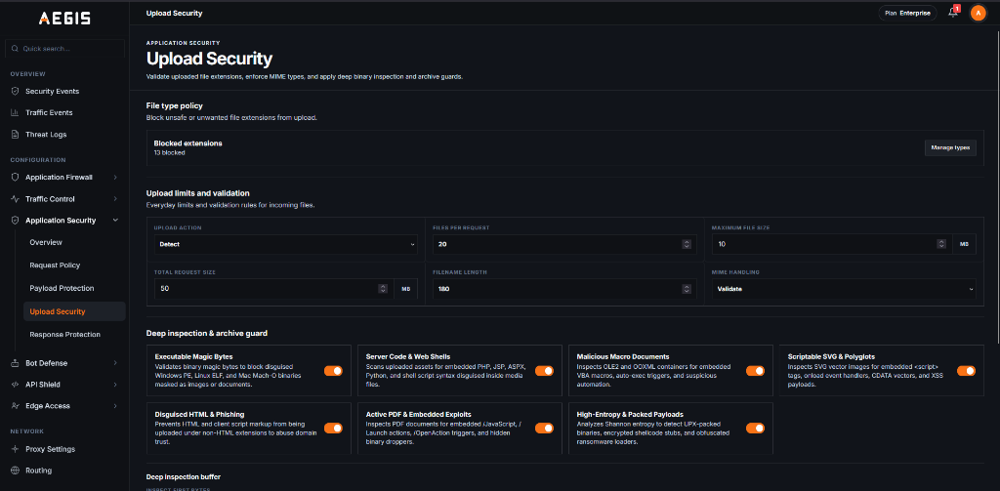
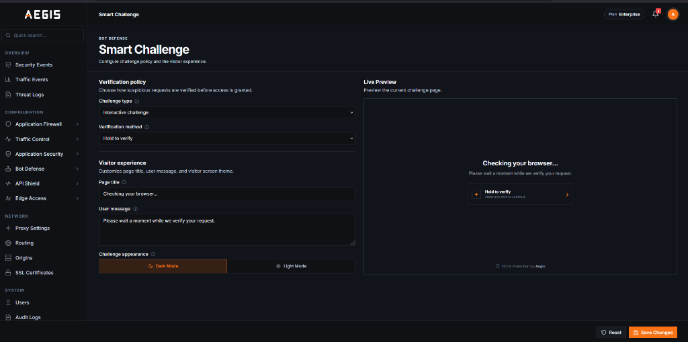

<p align="center">
  <a href="https://divinelab.io/products/aegis">
    
  </a>
</p>

<h1 align="center">Aegis Community Edition</h1>

<p align="center">
  <strong>Open-Source Web Application Firewall &amp; Edge Security Gateway</strong><br>
  High-performance reverse proxy delivering real-time threat defense, Layer 7 rate limiting, and dynamic zero-downtime policy control.
</p>

<p align="center">
  <a href="https://divinelab.io/products/aegis" target="_blank" rel="noopener noreferrer">
    
  </a>
  &nbsp;&nbsp;
  <a href="#quick-start">
    
  </a>
  &nbsp;&nbsp;
  <a href="https://divinelab.io/products/aegis/docs" target="_blank" rel="noopener noreferrer">
    
  </a>
  &nbsp;&nbsp;
  <a href="https://demo-aegis.divinelab.io/" target="_blank" rel="noopener noreferrer">
    
  </a>
</p>

---

<p align="center">
  
</p>

---

## Overview

Aegis is an open-source, high-performance Web Application Firewall and reverse proxy designed to protect web applications, APIs, and microservices at the network edge. Positioned in front of your upstream services, Aegis inspects incoming HTTP and HTTPS traffic in real time, stopping cyber attacks, malicious bots, and abusive traffic surges before they can reach your backend infrastructure.

All routing rules, firewall policies, rate limits, and SSL certificates are managed dynamically through an integrated web console with zero downtime and no configuration restarts.

---

## Key Capabilities

### Application Firewall

- **OWASP Core Rule Set (CRS) Defense:** Native integration with the OWASP Core Rule Set (CRS) protecting against OWASP Top 10 web threats including SQL Injection (SQLi), Cross-Site Scripting (XSS), Remote Code Execution (RCE), SSRF, and unauthorized path traversal.
- **Intelligent Anomaly Scoring:** Evaluates cumulative threat scores across CRS rule matches before taking blocking actions, drastically reducing false positives on legitimate customer traffic.
- **Flexible Inspection Modes:** Tailor protection levels and CRS paranoia levels from baseline monitoring for public web services to strict blocking for critical APIs and payment gateways.
- **Custom Rules & Whitelisting:** Quickly define exceptions, whitelist trusted traffic, and create custom security policies to support unique business requirements.

### Traffic Control & Anti-Abuse

- **Rate Limiting & Anti-Scraping:** Throttles abusive requests to safeguard authentication endpoints, checkout flows, and APIs against automated credential stuffing and scraping.
- **IP Access Control:** Block malicious actors or whitelist partner networks using individual IP addresses or network ranges with immediate policy enforcement.
- **Geo-Blocking:** Allow or deny traffic based on geographic origin to protect applications against unwanted regional traffic or meet regional compliance needs.
- **Connection Protection:** Enforce connection thresholds and timeouts to defend backend infrastructure against volumetric surges and denial-of-service attempts.

### HTTP Hardening & Server Protection

- **Protocol Enforcement:** Restrict acceptable HTTP methods and immediately reject unauthorized or malformed requests before they reach origin servers.
- **Request Size & Payload Limits:** Safeguard backend services against memory exhaustion and buffer attacks by enforcing strict boundaries on headers and payloads.
- **File Upload Protection:** Intercepts multipart uploads and automatically blocks dangerous executable files before they reach file storage or processing pipelines.
- **Automated Security Headers:** Automatically injects enterprise-grade browser protection headers including HSTS, Content Security Policy (CSP), and X-Frame-Options to prevent clickjacking and data injection.
- **Infrastructure Cloaking:** Masks backend server banners, software versions, and internal infrastructure headers to prevent attacker reconnaissance.

### Automated SSL/TLS

- **Automated Certificate Management:** Integrates seamlessly with Let's Encrypt to provision, validate, and auto-renew TLS certificates with zero manual oversight or downtime.
- **Enterprise Certificate Management:** Full support for custom enterprise certificates, wildcard domains, and multi-domain SNI routing for complex environments.
- **Strict Cryptographic Standards:** Enforces modern TLS 1.2 and TLS 1.3 standards with Perfect Forward Secrecy, automatically disabling obsolete protocols and weak ciphers.

### Reverse Proxy & Load Balancing

- **High-Performance Ingress:** Native edge gateway supporting HTTP/1.1, HTTP/2, and HTTP/3 (QUIC) for accelerated content delivery and modern client compatibility.
- **Dynamic Route Management:** Direct traffic based on hostnames, path rules, and request attributes with deterministic priority matching.
- **Load Balancing & High Availability:** Distribute traffic across upstream server clusters with continuous active health monitoring and automatic failover away from unhealthy nodes.

### Management & Monitoring

- **Centralized Operations Console:** Full-featured web management interface providing real-time visibility into traffic trends, threat activity, and instant policy tuning.
- **Enterprise Access Security:** Multi-factor authentication (2FA/TOTP) and isolated management interface binding to keep administrative controls secure from external networks.
- **Monitoring & Observability:** Real-time traffic analytics, threat inspection logs, and centralized telemetry for operational visibility and security reporting.
- **Enterprise Scalability:** High-throughput architecture built for demanding production traffic, delivering deep packet inspection with sub-millisecond overhead.

---

## Quick Start <a id="installation"></a>

### Option 1: 1-Line Universal Rapid Install (Recommended)

Run the universal installer on any modern Linux system:

```bash
curl -fsSL https://get.divinelab.io/installAegis.sh | sudo bash
```

*Or via git clone:*
```bash
git clone https://github.com/divinelabio/aegis.git
cd aegis
sudo bash install.sh
```

---

### Option 2: Docker Compose

Deploy the complete Aegis stack with PostgreSQL and ClickHouse real-time analytics:

```yaml
version: '3.8'

services:
  aegis:
    image: ghcr.io/divinelabio/aegis:latest
    container_name: aegis_server
    restart: unless-stopped
    ports:
      - "8080:8080" # Ingress Traffic & WAF Proxy
      - "8081:8081" # Web Admin Console & Control API
    environment:
      AEGIS_ADMIN_PASSWORD: ${AEGIS_ADMIN_PASSWORD:-admin}
      AEGIS_CONTROL_DB_HOST: postgres
      AEGIS_CONTROL_DB_PORT: "5432"
      AEGIS_ANALYTICS_HOST: clickhouse
      AEGIS_ANALYTICS_PORT: "9000"
    depends_on:
      postgres:
        condition: service_healthy
      clickhouse:
        condition: service_healthy
    volumes:
      - aegis_data:/var/lib/aegis/data

  postgres:
    image: postgres:16-alpine
    container_name: aegis_postgres
    restart: unless-stopped
    environment:
      POSTGRES_DB: aegis
      POSTGRES_USER: aegis
      POSTGRES_PASSWORD: ${AEGIS_CONTROL_DB_PASSWORD:-testdb}
    volumes:
      - postgres_data:/var/lib/postgresql/data
    healthcheck:
      test: ["CMD-SHELL", "pg_isready -U aegis -d aegis"]
      interval: 5s
      timeout: 3s
      retries: 5

  clickhouse:
    image: clickhouse/clickhouse-server:25.8
    container_name: aegis_clickhouse
    restart: unless-stopped
    environment:
      CLICKHOUSE_DB: aegis
      CLICKHOUSE_USER: default
      CLICKHOUSE_PASSWORD: ""
    ports:
      - "9000:9000"
      - "8123:8123"
    volumes:
      - clickhouse_data:/var/lib/clickhouse
    healthcheck:
      test: ["CMD", "clickhouse-client", "--query", "SELECT 1"]
      interval: 5s
      timeout: 3s
      retries: 10

volumes:
  aegis_data:
  postgres_data:
  clickhouse_data:
```

Start the stack:
```bash
docker compose up -d
```

---

### Option 3: Pre-compiled Standalone Binary (Zero-Dependency)

If you prefer to run Aegis natively without Docker, download the official pre-compiled package directly from [GitHub Releases](https://github.com/divinelabio/aegis/releases). Each release package is completely self-contained and includes the executable with the **embedded Web Admin UI**, default `config.yaml`, and rulesets.

#### Linux (amd64 / arm64)

```bash
# 1. Download and extract the latest release package
curl -sSL https://github.com/divinelabio/aegis/releases/latest/download/aegis-linux-amd64.tar.gz | tar -xz

# 2. (Optional) Move executable to system PATH
sudo mv aegis /usr/local/bin/
sudo mv aegisctl /usr/local/bin/ 2>/dev/null || true

# 3. Start Aegis WAF
aegis run -c config.yaml
```

#### Windows (x64)

1. Download [`aegis-windows-amd64.zip`](https://github.com/divinelabio/aegis/releases/latest/download/aegis-windows-amd64.zip) from GitHub Releases.
2. Extract the archive into a folder of your choice.
3. Open PowerShell in that directory and start the server:
```powershell
.\aegis.exe run -c config.yaml
```

> **Web Admin Console:** Once running, navigate to **`http://<your-server-ip>:8081`** in your browser. (The full web dashboard is embedded inside the binary; no Node.js or web server required).

---

### Option 4: Build & Install from Source (For Developers)

To contribute to Aegis or build directly from the latest commit:

#### Prerequisites
* **Go:** 1.22 or higher ([golang.org/dl](https://golang.org/dl/))
* **Node.js:** 18+ *(only required if modifying the TypeScript frontend in `web/admin`)*
* **Git**

#### Compilation Steps

```bash
# 1. Clone the repository
git clone https://github.com/divinelabio/aegis.git
cd aegis

# 2. Build the binaries using Makefile
make build

# Or compile directly with the Go toolchain:
go build -ldflags="-s -w" -o bin/aegis ./cmd/aegis-server
go build -ldflags="-s -w" -o bin/aegisctl ./cmd/aegisctl

# 3. (Optional) Rebuild the Web Admin UI if you modify frontend code
npm run admin:build

# 4. Start Aegis from source
./bin/aegis run -c config.yaml
```

---

## Commercial Editions & Advanced Modules

Aegis Community Edition provides complete Layer-7 WAF protection. For enterprise environments requiring automated bot defense, external threat intelligence feeds, and compliance scanning, advanced capabilities can be unlocked with a license from [DivineLab](https://divinelab.io):

* **AI Bot & Crawler Defense:** Dynamic behavioral challenges and automated bot mitigation.
* **OrbitQuant CTI Feeds:** Real-time IP reputation and threat intelligence lists updated automatically.
* **Data Leak Prevention (DLP):** Automatic masking of sensitive customer data (Credit Cards, SSNs, PII).
* **Payload & File Upload Security:** Deep payload inspection and antivirus integration for uploaded files.
* **OpenAPI 3.0 Contract Enforcement:** Strict API schema validation and rogue endpoint blocking.

To upgrade or obtain an evaluation license, visit [divinelab.io/products/aegis](https://divinelab.io/products/aegis).


---

## Web Console

<table width="100%" cellpadding="6">
  <tr>
    <td width="50%" align="center">
      <br>
      <a href="docs/images/aegis-dashboard.png">
        
      </a>
      <br><br>
    </td>
    <td width="50%" align="center">
      <br>
      <a href="docs/images/waf-rulesets-dashboard.png">
        
      </a>
      <br><br>
    </td>
  </tr>
  <tr>
    <td width="50%" align="center">
      <br>
      <a href="docs/images/waf-dashboard.png">
        
      </a>
      <br><br>
    </td>
    <td width="50%" align="center">
      <br>
      <a href="docs/images/geo-blocking-dashboard.png">
        
      </a>
      <br><br>
    </td>
  </tr>
  <tr>
    <td width="50%" align="center">
      <br>
      <a href="docs/images/upload-security-dashboard.png">
        
      </a>
      <br><br>
    </td>
    <td width="50%" align="center">
      <br>
      <a href="docs/images/bot-challenge-dashboard.png">
        
      </a>
      <br><br>
    </td>
  </tr>
</table>

---

## License

Aegis is licensed under the [Business Source License 1.1 (BSL 1.1)](LICENSE).

* **Free for Production Use:** Free to copy, modify, and deploy across your internal services, APIs, and production workloads.
* **Commercial Restriction:** Offering Aegis as a competing managed cloud service or commercial WAF SaaS requires an enterprise license.

For enterprise licensing, OEM distribution, and production support, visit [divinelab.io](https://divinelab.io) or contact [contact@divinelab.io](mailto:contact@divinelab.io).
